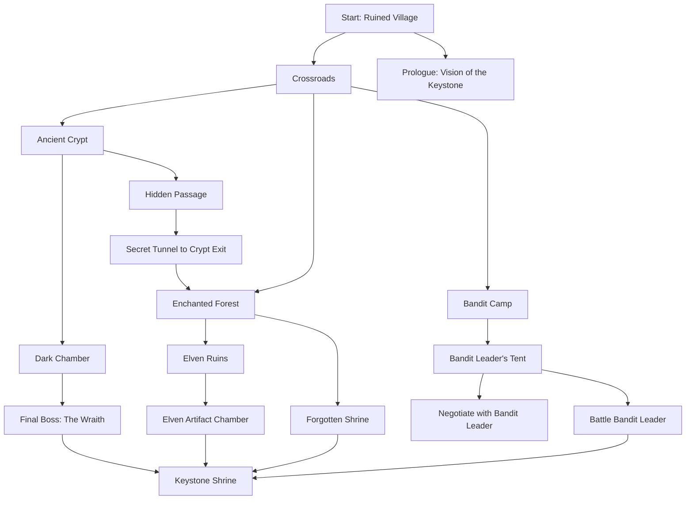

```mermaid
graph TD
    A[Start: Ruined Village] --> B[Crossroads]
    B --> C[Ancient Crypt]
    B --> D[Enchanted Forest]
    B --> E[Bandit Camp]
    C --> F[Dark Chamber]
    C --> G[Hidden Passage]
    D --> H[Elven Ruins]
    D --> I[Forgotten Shrine]
    E --> J[Bandit Leader's Tent]
    F --> K[Final Boss: The Wraith]
    G --> L[Secret Tunnel to Crypt Exit]
    H --> M[Elven Artifact Chamber]
    I --> N[Keystone Shrine]
    J --> O[Negotiate with Bandit Leader]
    J --> P[Battle Bandit Leader]

    A --> Q[Prologue: Vision of the Keystone]

    K --> N
    L --> D
    M --> N
    P --> N
```
